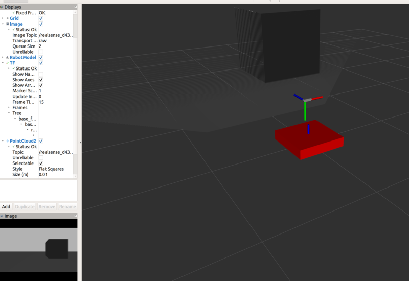

realsense_description
=========
This repository contains the necessary files for simulating Intel realsense camera in Gazebo. It currently contains realsense D435 model only.

**Installation**

Clone this repository into your catkin workspace and resource the workspace. It doesn't have dependencies other than Gazebo (libgazebo_ros_openni_kinect).

**Usage**

Execute the example roslaunch.
> roslaunch realsense_description example_d435.launch

You can include the camera to your robot urdf as shown in the example urdf `/urdf/example_d435.urdf.xacro`.

**Add realsense model to GAZEBO models**
To add the camera model to gazebo models:
 - Copy the contents of gazebo_model directory to `~/.gazebo/models`
    > cp -r < path-to-realsense_description >/gazebo_model/   ~/.gazebo/models/realsense_d435

 - Copy the `meshes` directory
    > cp -r <path-to-realsense_description>/gazebo_model/meshes/ ~/.gazebo/models/realsense_d435/meshes

Contributions to add more realsense models are most welcome.
